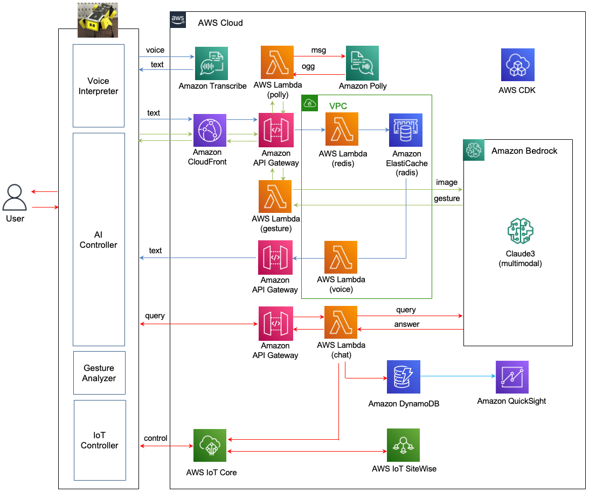

# AI Dansing Robot 

여기에서는 AI Dansing Robot에 대한 프로젝트를 준비합니다.

전체적인 Architecture는 아래와 같습니다. 
- Voice interpreter와 IoT Controller는 AWS IoT Greengrass에 Component로 설치되고, AI Controller는 로봇의 Chrome 브라우저에 javascript로 구성됩니다.
- 방문자의 음성은 Voice interpreter를 이용하여 텍스트로 변환합합니다. Voice interpreter는 지연시간을 최소화하기 위하여 Amazon Transcribe를 이용하여 음성을 텍스트로 변환합니다.
- 이후 텍스트는 CloudFront - API Gateway - Lambda(redis) - Amazon ElastiCache를 이용해 pubsub 방식으로 AI controller로 전달됩니다.
- 제스처는 Local에서 분석되어 결과가 AI Controller로 전달됩니다.
- 제스처 이외의 이미지 분석은 AI Controller가 Capture한 이미지를 CloudFront - API Gateway - Lambda(gesture)를 거쳐서 Bedrock의 Claude3 (Sonnet)을 이용하여 이미지를 해석합니다.
- 방문객의 음성은 텍스트로 전환되어 Chatbot 형태로 화면에 표시되어 사용자가 AI Robot이 동작하는것을 쉽게 이해할 수 있습니다.
- 변환된 텍스트는 WebSoket 방식으로 API Gateway - Lambda(chat를 통해 Bedrock의 Claud3 (Haiku)를 이용해 처리됩니다. 이때 다양한 사용자의 의도를 Prompt Engineering을 이용해 처리하게 됩니다.
- 최종적으로 결과는 Amazon Polly를 이용해 사용자에게 전달됩니다.
- 이때, Dansing robot은 다양한 동작을 IoT Controller를 이용해 수행합니다.
- 사용자의 접속 및 관련 메트릭은 DynamoDB를 통해 수집되어 QuickSight로 표시됩니다.
- IoT 관련 정보는 IoT SiteWise등을 이용해 별도의 Dashboard에 각종 IoT 정보와 함께 방문객이 확인할 수 있습니다.




## 데모 준비

### 사전 준비 사항

이 솔루션을 사용하기 위해서는 사전에 아래와 같은 준비가 되어야 합니다.

- [AWS Account 생성](https://repost.aws/ko/knowledge-center/create-and-activate-aws-account)

### 인프라 설치

[인프라 설치](./deployment.md)에 따라 CDK로 인프라 설치를 진행합니다. 

현재는 Interpreter(voice to text)는 terminal에서 직접 명령어를 설치하지만 추후 AWS IoT Greengrass (v2)를 이용하여 component로 자동설치를 수행합니다. 


### 실행결과

## 리소스 정리하기 

더이상 인프라를 사용하지 않는 경우에 아래처럼 모든 리소스를 삭제할 수 있습니다. 

1) [API Gateway Console](https://ap-northeast-1.console.aws.amazon.com/apigateway/main/apis?region=ap-northeast-1)로 접속하여 "api-chatbot-for-rag-enhanced-searching", "api-rag-enhanced-searching"을 삭제합니다.

2) [Cloud9 console](https://ap-northeast-1.console.aws.amazon.com/cloud9control/home?region=ap-northeast-1#/)에 접속하여 아래의 명령어로 전체 삭제를 합니다.


```text
cd ~/environment/rag-enhanced-searching/cdk-rag-enhanced-searching/ && cdk destroy --all
```
